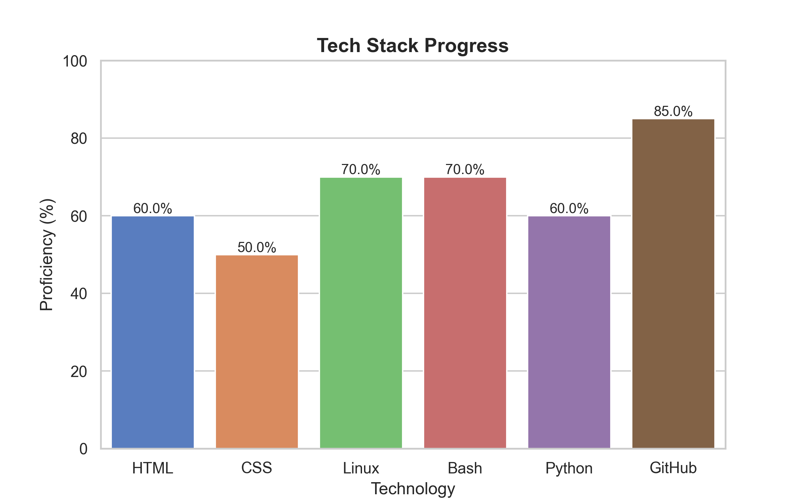

<h1 align="center">Hi 👋, I'm Deepak Singh</h1>

  

  
  

## 💻 Tech Stack

  
   
  

## 📊 Tech Progress

<picture>
  <source media="(prefers-color-scheme: dark)" srcset="scripts/tech_progress.png">
  <source media="(prefers-color-scheme: light)" srcset="scripts/tech_progress.png">
  
</picture>

## 📊 GitHub Insights

  
  

## 🏆 Achievements

- 🛡️ Reported vulnerabilities in real-world applications  
- 🧪 Contributed to open-source security projects  
- 🎯 Active participant in bug bounty programs  
- 🚀 Goal: Become a professional Security Researcher  

## 📜 Certifications

 

---

✨ Crafted with passion by <b>Deepak Singh</b> ✨

